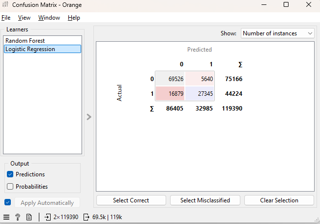
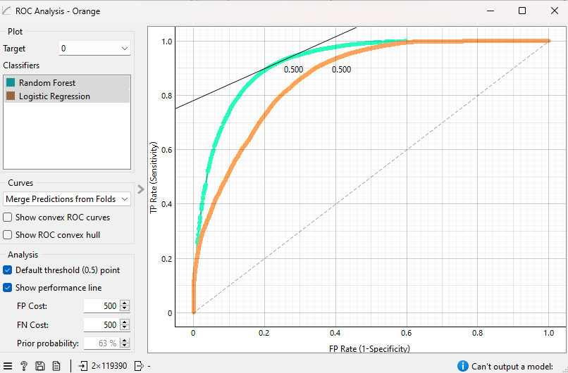

# Hotel Booking Analytics & Cancellation Prediction

## Project Overview

This project analyzes hotel booking behavior and builds a machine learning model to predict booking cancellations.

The project combines:
- Business analytics using an Excel dashboard
- Machine learning models using Orange Data Mining

The goal is to understand booking trends, identify factors affecting cancellations, and evaluate predictive models.


### Key Dashboard Insights

- Peak booking demand occurs during **August**
- Cancellation rates exceed **40% during April–June**
- **Group bookings** show the highest cancellation rate
- **Direct and Online TA channels** generate the highest ADR


## Machine Learning Model (Orange Data Mining)

A machine learning workflow was built using **Orange Data Mining** to predict whether a booking will be cancelled.

Models tested:
- Logistic Regression
- Random Forest

  

## Model Performance

Random Forest performed better than Logistic Regression across most evaluation metrics.

| Model | AUC | Accuracy | F1 Score | Precision | Recall |
|------|------|------|------|------|------|
| Random Forest | 0.922 | 0.862 | 0.860 | 0.862 | 0.862 |
| Logistic Regression | 0.863 | 0.811 | 0.804 | 0.814 | 0.811 |


### Confusion Matrix




### ROC Curve




## Project Structure

```
hotel-booking-analytics
│
├── data
│   └── hotel_booking.csv
│
├── dashboard
│   └── README.md
│
├── orange-model
│   ├── hotel_booking_prediction.ows
│   └── README.md
│
├── screenshots
│   ├── dashboard.png
│   ├── orange_workflow.png
│   ├── confusion_matrix.png
│   └── roc_curve.png
│
└── README.md
```


